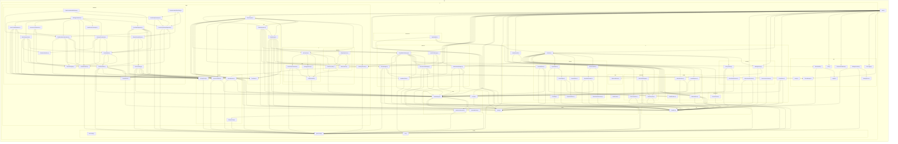

```mermaid
flowchart LR

subgraph 0["src"]
subgraph 1["js"]
subgraph 2["bus"]
3["EventBus.js"]
end
subgraph 4["config"]
5["dev-config.js"]
6["env.js"]
7["game-config.js"]
end
subgraph 8["interaction"]
9["InputHandler.js"]
end
subgraph A["ui"]
subgraph B["animation"]
C["SceneTransition.js"]
2T["AnimationManager.js"]
2U["ParticleSystem.js"]
end
D["Renderer.js"]
subgraph N["board"]
O["BoardAnimation.js"]
P["BoardRenderer.js"]
Q["NodeInitializer.js"]
R["NodeRenderer.js"]
end
subgraph S["decisions"]
T["DecisionPanel.js"]
end
subgraph U["effects"]
V["FlyAnimation.js"]
W["FirstFlight.js"]
X["SecondFlight.js"]
Y["ExplosionEffects.js"]
Z["ImpactEffects.js"]
10["StemAnimation.js"]
11["StemManifestation.js"]
12["StemParticleGenerator.js"]
1F["PassiveEffects.js"]
end
subgraph 13["overlays"]
14["VictoryOverlay.js"]
15["ActionStatsRenderer.js"]
16["WaitingOverlay.js"]
2V["AchievementOverlay.js"]
2W["ReconnectionOverlay.js"]
end
subgraph 17["utils"]
18["ClipboardHelper.js"]
end
2Q["LeaderboardUI.js"]
2R["NodeCache.js"]
2S["ScoreEffects.js"]
end
subgraph E["state"]
F["StateManager.js"]
I["ImmutableState.js"]
J["StateScoreRecorder.js"]
2P["ui-state.js"]
end
subgraph G["types"]
H["events.js"]
end
subgraph K["logic"]
subgraph L["actions"]
M["RarityScoring.js"]
1M["ActionCandidates.js"]
1N["ActionResolver.js"]
20["ScoringConfig.js"]
end
19["AuthorityExecutor.js"]
subgraph 1A["flow"]
1B["TurnRules.js"]
1X["GameSequence.js"]
1Z["TurnManager.js"]
end
1C["GameEngine.js"]
subgraph 1O["ai"]
1P["AIController.js"]
subgraph 1Q["core"]
1R["ActionValueCalculator.js"]
1S["UnityEvaluator.js"]
1T["StrategySelector.js"]
end
subgraph 1U["learning"]
1V["GameRecorder.js"]
1W["StatsCollector.js"]
21["WeightOptimizer.js"]
end
end
subgraph 22["headless"]
23["ActionTradeoffAnalysis.js"]
24["FixedPositionContinuations.js"]
25["HeadlessMatch.js"]
26["ScopedState.js"]
27["PublicStrategies.js"]
28["SeededMatch.js"]
29["SeededRandom.js"]
2A["BatchComparison.js"]
2B["EvaluationStatistics.js"]
2C["CrossoverConfirmation.js"]
2D["ExperimentAttackBuffSweep.js"]
2E["Phase1SweepRunner.js"]
2F["SearchStrategy.js"]
2G["ScoreRarityReanalysis.js"]
2H["ScoreUnityOverlapDiagnostic.js"]
2I["ExperimentNerfBurstRarity.js"]
2J["StateStructureAnalysis.js"]
2K["StrategyEvaluation.js"]
2L["StrategyTournament.js"]
2M["TurnOrderDiagnostic.js"]
end
end
subgraph 1D["network"]
1E["SimplifiedPVPManager.js"]
1J["ReconnectionManager.js"]
1L["supabaseClient.js"]
1Y["RoomManager.js"]
2N["LeaderboardManager.js"]
2O["LocalPVPManager.js"]
end
subgraph 1G["utils"]
1H["ErrorHandler.js"]
1I["Logger.js"]
1K["TimerManager.js"]
2X["DebugController.js"]
2Y["DebugStyle.css"]
2Z["PVPLogger.js"]
30["PerformanceMonitor.js"]
31["dom.js"]
32["easing.js"]
end
end
33["main.js"]
end
9-->3
9-->C
9-->D
C-->3
C-->7
D-->3
D-->7
D-->F
D-->H
D-->O
D-->P
D-->R
D-->T
D-->V
D-->Z
D-->10
D-->14
D-->16
F-->3
F-->H
F-->I
F-->J
J-->7
J-->M
M-->7
O-->3
O-->F
P-->F
P-->Q
Q-->7
T-->7
V-->R
V-->W
V-->X
W-->3
X-->3
X-->R
X-->Y
Z-->R
10-->11
10-->12
11-->3
11-->7
11-->F
12-->7
14-->3
14-->F
14-->15
15-->F
16-->3
16-->18
19-->7
19-->1B
1C-->3
1C-->7
1C-->1E
1C-->F
1C-->H
1C-->1F
1C-->1M
1C-->1N
1C-->1P
1C-->19
1C-->1X
1C-->1Z
1E-->3
1E-->19
1E-->F
1E-->H
1E-->1F
1E-->1H
1E-->1J
1E-->1L
1F-->3
1F-->F
1F-->H
1H-->3
1H-->1I
1J-->3
1J-->7
1J-->F
1J-->1K
1J-->1E
1J-->1L
1L-->6
1M-->7
1M-->F
1N-->7
1N-->F
1P-->1R
1P-->1T
1P-->1S
1P-->1V
1P-->1W
1R-->7
1R-->F
1R-->1S
1S-->F
1T-->1S
1V-->F
1V-->1S
1X-->3
1X-->1Y
1X-->1E
1X-->1L
1X-->F
1X-->19
1X-->1Z
1Y-->3
1Y-->7
1Y-->H
1Y-->1K
1Y-->1L
1Z-->3
1Z-->7
1Z-->1E
1Z-->F
1Z-->H
1Z-->1F
1Z-->1P
1Z-->19
1Z-->1B
20-->7
21-->1V
21-->1W
23-->1M
23-->1N
23-->20
23-->1B
23-->24
23-->26
24-->20
24-->25
24-->27
24-->28
24-->29
25-->7
25-->F
25-->1M
25-->1N
25-->20
25-->1B
25-->26
26-->J
28-->25
28-->27
28-->29
29-->7
2A-->20
2A-->2B
2A-->25
2A-->27
2A-->28
2A-->29
2C-->20
2C-->24
2C-->27
2D-->2E
2D-->2G
2D-->2H
2E-->25
2E-->2F
2E-->28
2F-->7
2F-->F
2F-->1M
2F-->1N
2F-->20
2F-->1B
2F-->26
2G-->7
2G-->2H
2H-->7
2H-->25
2H-->2E
2H-->2G
2H-->28
2I-->2E
2I-->2G
2I-->2H
2K-->20
2K-->23
2K-->2A
2K-->2C
2K-->24
2K-->27
2K-->29
2K-->2J
2K-->2L
2K-->2M
2L-->2B
2L-->25
2L-->27
2L-->28
2M-->1M
2M-->1N
2M-->20
2M-->1B
2M-->24
2M-->26
2M-->28
2N-->3
2N-->F
2N-->H
2N-->1L
2O-->3
2O-->19
2O-->F
2P-->3
2Q-->3
2Q-->2N
2S-->3
2S-->F
2S-->H
2T-->3
2T-->H
2T-->2U
2U-->3
2U-->H
2V-->3
2V-->H
2W-->3
2X-->3
2X-->7
2X-->2Y
33-->3
33-->7
33-->9
33-->1X
33-->1C
33-->2N
33-->1J
33-->1Y
33-->1E
33-->1L
33-->F
33-->2P
33-->H
33-->2T
33-->2U
33-->2Q
33-->2V
33-->2W
33-->16
33-->D
33-->2S
33-->31
33-->30
33-->2Z
33-->1K
```
